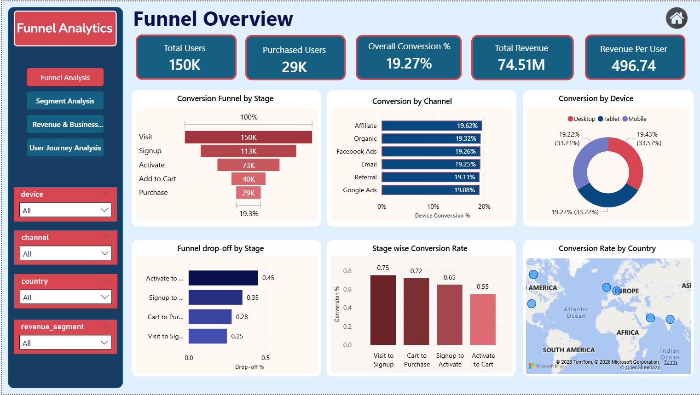
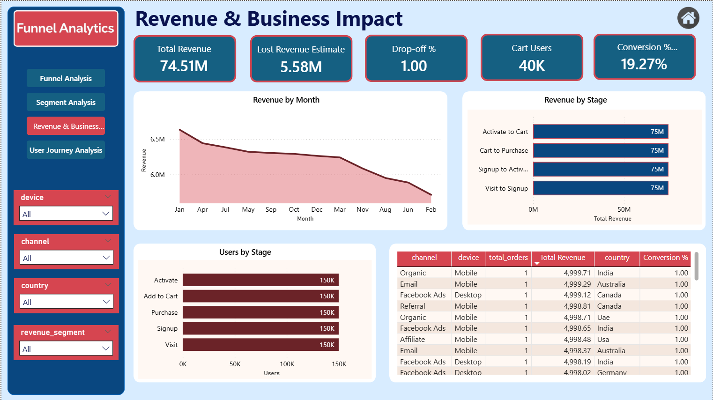

<h1 align="center">📊 Product Funnel Intelligence & Revenue Optimization</h1>

Google-level Product Analytics Case Study analyzing user conversion funnel, drop-offs, and revenue optimization opportunities

<h2>📌 Project Overview</h2>

This project analyzes a <b>multi-stage product conversion funnel</b> to identify user drop-offs, 
optimize conversion rates, and improve revenue performance. The analysis tracks 
user behavior across the complete product journey:

<b>Visit → Signup → Activate → Add to Cart → Purchase</b>

The goal is to understand where users leave the funnel, why conversion drops, and what 
product improvements can increase revenue.

<h2>🎯 Business Objectives</h2>

<ul>
<li>Identify weakest stage in conversion funnel</li>
<li>Measure stage-wise conversion rates</li>
<li>Analyze user behavior across devices & channels</li>
<li>Measure revenue performance</li>
<li>Find optimization opportunities</li>
<li>Recommend product improvements</li>
</ul>

<h2>📊 Dataset Overview</h2>

<ul>
<li><b>Total Users:</b> 150,000</li>
<li><b>Purchased Users:</b> 29,000</li>
<li><b>Overall Conversion:</b> 19.27%</li>
<li><b>Total Revenue:</b> 74.51M</li>
<li><b>Revenue per User:</b> 496.74</li>
</ul>

<h2>📈 Funnel Performance</h2>

<table>
<tr><th>Stage</th><th>Users</th></tr>
<tr><td>Visit</td><td>150,000</td></tr>
<tr><td>Signup</td><td>113,000</td></tr>
<tr><td>Activate</td><td>73,000</td></tr>
<tr><td>Add to Cart</td><td>40,000</td></tr>
<tr><td>Purchase</td><td>29,000</td></tr>
</table>

 

<b>Stage Conversion</b>

<ul>
<li>Visit → Signup: 75%</li>
<li>Signup → Activate: 64%</li>
<li>Activate → Cart: 55%</li>
<li>Cart → Purchase: 72%</li>
</ul>

<b>Largest Drop-off:</b> Activate → Add to Cart (45%)

<h2>🛠 Tools & Technologies</h2>

<ul>
<li>Python — Data cleaning & feature engineering</li>
<li>Pandas & NumPy — Data analysis</li>
<li>SQL — Funnel queries & segmentation</li>
<li>Excel — KPI validation</li>
<li>Power BI — Dashboard & visualization</li>
<li>DAX — Conversion & revenue metrics</li>
</ul>

<h2>📊 Key Insights</h2>

<ul>
<li>Largest drop-off occurs between Activate and Add to Cart (45%)</li>
<li>Top funnel conversion is strong (75%)</li>
<li>Checkout conversion is high (72%)</li>
<li>Only 19.27% users convert overall</li>
<li>Revenue heavily dependent on cart-stage users</li>
<li>Device performance nearly identical</li>
<li>Channels show consistent conversion</li>
<li>Activation stage loses 33K users</li>
<li>Improving mid funnel can increase revenue significantly</li>
<li>Conversion improvement offers large business opportunity</li>
</ul>

<h2>💡 Business Recommendations</h2>

<ul>
<li>Improve activation to cart transition</li>
<li>Add product discovery improvements</li>
<li>Improve onboarding flow</li>
<li>Add stronger CTA buttons</li>
<li>Retarget cart abandoners</li>
<li>Run A/B testing on weakest stage</li>
<li>Improve product engagement</li>
</ul>

<h2>📷 Dashboard Preview</h2>

<h3>Overview Dashboard</h3>

<h3>Funnel Analysis</h3>

<h3>Revenue Insights</h3>

<h3>User Journey Analysis</h3>

<h2>📂 Project Structure</h2>

<pre>
project/
│
├── data/
│   ├── users.csv
│   ├── events.csv
│   └── orders.csv
│
├── dashboard/
│   └── Funnel Dashboard.pbix
│
├── Images/
│   ├── image-1.png
│   ├── image-2.png
│   ├── image-3.png
│   └── image-4.png
│
└── README.md
</pre>

<h2>📊 Business Impact</h2>

If conversion improves:

19.27% → 25%

New Purchases:

150K × 25% = 37.5K

Increase:

+8.5K purchases

Revenue Increase:

+4.2M revenue

<h2>👨‍💻 Author</h2>

<b>Kuldeep Rathore</b>

  

<a href="https://www.linkedin.com/in/kuldeeprathore9440">
LinkedIn Profile
</a>

⭐ If you like this project, give it a star!

