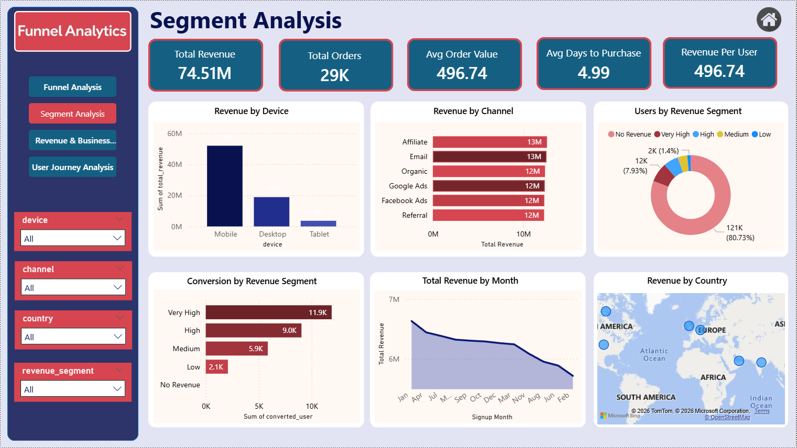
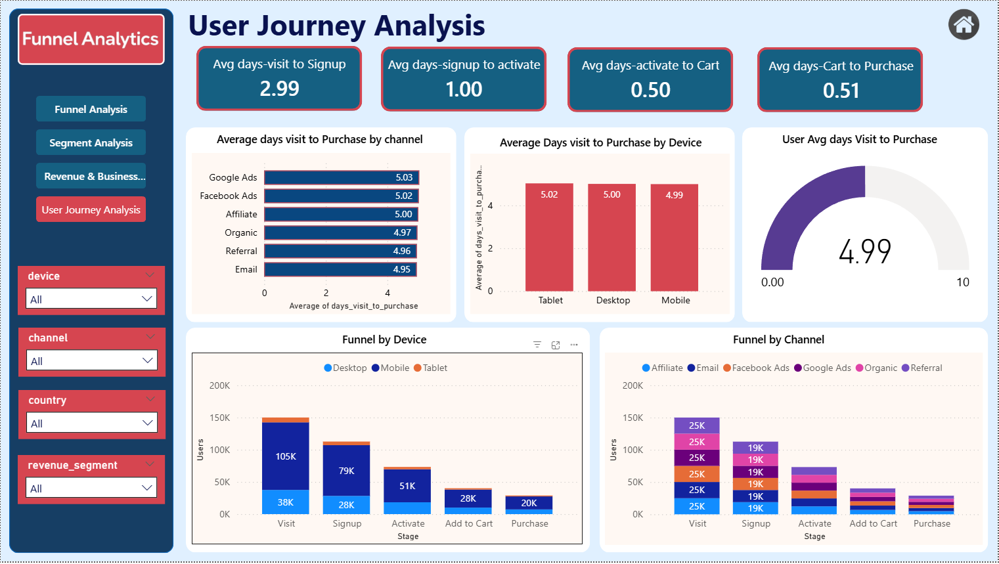

<h1 align="center">📊 Product Funnel Intelligence & Revenue Optimization</h1>

Google-level Product Analytics Case Study analyzing user conversion funnel, drop-offs, and revenue optimization opportunities

<h2>📌 Project Overview</h2>

This project analyzes a <b>multi-stage product conversion funnel</b> to identify user drop-offs, 
optimize conversion rates, and improve revenue performance. The analysis tracks 
user behavior across the complete product journey:

<b>Visit → Signup → Activate → Add to Cart → Purchase</b>

The objective is to understand where users exit the funnel, why conversion drops, 
and what product decisions can improve user engagement and revenue growth.

<h2>🎯 Business Objectives</h2>

<ul>
<li>Identify weakest stage in conversion funnel</li>
<li>Measure stage-wise conversion rates</li>
<li>Analyze user behavior across devices, channels, and countries</li>
<li>Measure revenue performance by segment</li>
<li>Detect mid-funnel drop-offs impacting growth</li>
<li>Recommend product and UX improvements</li>
<li>Estimate revenue optimization opportunity</li>
</ul>

<h2>📊 Dataset Overview</h2>

<ul>
<li><b>Total Users:</b> 150,000</li>
<li><b>Purchased Users:</b> 29,000</li>
<li><b>Overall Conversion:</b> 19.27%</li>
<li><b>Total Revenue:</b> 74.51M</li>
<li><b>Revenue per User:</b> 496.74</li>
</ul>

<h2>📈 Funnel Performance</h2>

<table>
<tr><th>Stage</th><th>Users</th><th>Conversion</th></tr>
<tr><td>Visit</td><td>150,000</td><td>-</td></tr>
<tr><td>Signup</td><td>113,000</td><td>75%</td></tr>
<tr><td>Activate</td><td>73,000</td><td>64%</td></tr>
<tr><td>Add to Cart</td><td>40,000</td><td>55%</td></tr>
<tr><td>Purchase</td><td>29,000</td><td>72%</td></tr>
</table>

 

<b>Largest Drop-off:</b> Activate → Add to Cart (45%)

The mid-funnel activation stage shows the highest user loss, indicating 
product engagement and discovery friction before purchase intent.

<h2>⚙️ Workflow</h2>

<ul>
<li>Collected and structured user, event, and order datasets</li>
<li>Performed data cleaning and feature engineering using Python</li>
<li>Built funnel logic and stage flags</li>
<li>Created conversion and revenue metrics</li>
<li>Analyzed funnel drop-offs using SQL queries</li>
<li>Validated KPIs in Excel</li>
<li>Built interactive Power BI dashboard using DAX</li>
<li>Generated business insights and optimization recommendations</li>
</ul>

<h2>🛠 Tools & Technologies</h2>

<ul>
<li>Python — Data cleaning & feature engineering</li>
<li>Pandas & NumPy — Data transformation</li>
<li>SQL — Funnel analytics queries</li>
<li>Excel — KPI validation & pivot analysis</li>
<li>Power BI — Dashboard visualization</li>
<li>DAX — Conversion & revenue metrics</li>
</ul>

<h2>📊 Key Insights</h2>

<ul>
<li>Largest drop-off occurs between Activate and Add to Cart (45%)</li>
<li>Top funnel conversion is strong (75%) indicating effective acquisition</li>
<li>Checkout conversion is high (72%) showing strong purchase intent</li>
<li>Overall conversion remains low at 19.27%</li>
<li>Mid-funnel engagement is the primary bottleneck</li>
<li>Revenue depends heavily on users reaching cart stage</li>
<li>No acquisition channel dominates conversion performance</li>
<li>Activation stage loses ~33K users</li>
<li>Improving mid-funnel can significantly increase revenue</li>
<li>Conversion optimization offers large growth opportunity</li>
</ul>

<h2>💡 Business Recommendations</h2>

<ul>
<li>Improve activation to cart transition</li>
<li>Enhance product discovery experience</li>
<li>Add stronger CTA placement</li>
<li>Improve onboarding flow</li>
<li>Introduce guided product walkthrough</li>
<li>Retarget users dropping at activation stage</li>
<li>Run A/B tests on mid-funnel UX</li>
<li>Improve product engagement signals</li>
</ul>

<h2>📊 Business Impact</h2>

If overall conversion improves from <b>19.27%</b> to <b>25%</b>:

<ul>
<li><b>Expected Purchases:</b> 37.5K</li>
<li><b>Incremental Purchases:</b> +8.5K</li>
<li><b>Estimated Revenue Gain:</b> +4.2M</li>
</ul>

Even small improvements in mid-funnel conversion can generate 
significant revenue growth.

<h2>📷 Dashboard Preview</h2>

<h3>Funnel Analysis</h3>

<h3>Revenue Insights</h3>

<h3>Segment Analysis</h3>

<h3>User Journey Analysis</h3>

<h1>👨‍💻 Author</h1>

<b>Kuldeep Rathore</b> 
<a href="https://www.linkedin.com/in/kuldeeprathore9440">
LinkedIn Profile
</a>

